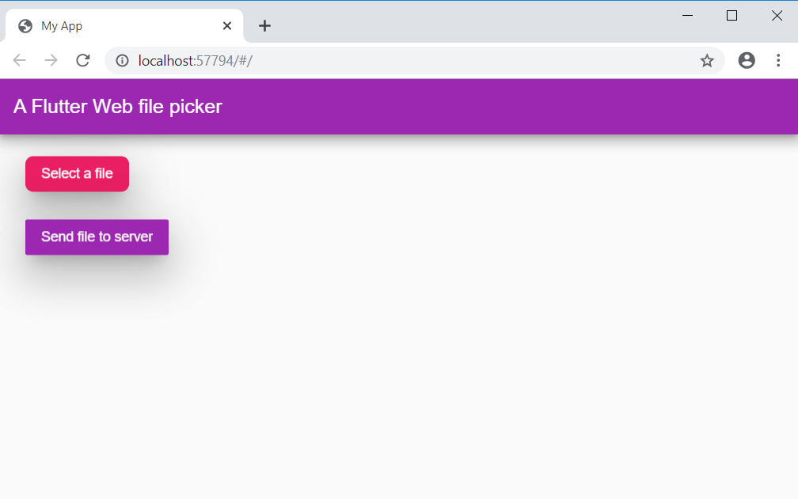

# File Upload with Flutter Web

A Flutter web app that will let you upload files

### Requirements

* Flutter Channel master version 1.12.5
* Android Studio version 3.5
* Visual Studio Code
* Dart SDK >=2.1.0 <3.0.0

### Dependencies

* Flutter cupertino localizations
* Flutter Cupertino Date Picker: ^1.0.12
* http: ^0.12.0+2

### Installation

* Clone this repository: https://github.com/rjcalifornia/web_upload.git
* Open the project Visual Studio Code 
* Run flutter pub get
